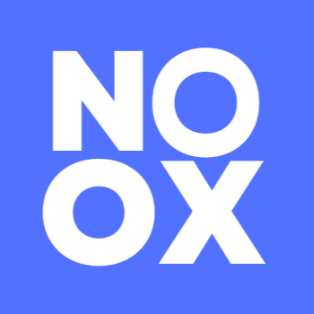

  

# Noximon 🚀

### Your Friendly Server Monitoring Companion

## 🌟 What is Noximon?

Noximon is your all-in-one server monitoring solution that makes keeping track of your servers as easy as pie! No more sleepless nights wondering if your servers are healthy - Noximon's got your back!

### 🎯 Key Features

- 🔔 **Smart Notifications** - Get instant alerts via Slack, Email, or SMS
- 🔍 **API Health Monitoring** - Keep tabs on your endpoints' performance
- 🐳 **Container Insights** - Docker container monitoring made simple
- 📊 **Resource Tracking** - CPU, Memory, Disk usage at your fingertips
- ⚡ **Lightning Fast Setup** - Be up and running in minutes
- 🎨 **Beautiful Dashboard** - Modern UI that's a joy to use

## 📸 Screenshots

  
  
<em>Simple utility tool for your to write your own monitoring script!!! </em>

  Made with ❤️ by the Nox

